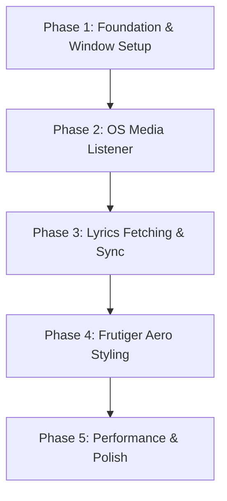

# 🎫 Project Backlog & Tickets: Live Lyrics

This file serves as our single source of truth for task tracking, milestones, and implementation goals. Each ticket is structured using our standard high-fidelity template (User Story, Context, Description, Requirements, and Verification Plan).

---

## 📋 Ticket Template

Use this empty blueprint when drafting new tickets to maintain consistent structure and quality:

```markdown
### 🎫 TICKET-XXX: [Title]
*   **User Story:** As a [role], I want to [action] so that [benefit].
*   **Context:** [Current state of the codebase/systems].
*   **Description:** [Detailed description of the task scope and what needs to change].
*   **Requirements:**
    *   [Technical rule, constraint, or dependency 1]
    *   [Technical rule, constraint, or dependency 2]
*   **Verification Plan (Acceptance Criteria):**
    *   [ ] [Test step, expected result, or Gherkin check 1]
    *   [ ] [Test step, expected result, or Gherkin check 2]
```

---


## 🗺️ Roadmap Overview



---

## 🔴 Phase 1: Foundation & Window Setup (Current)

### 🎫 TICKET-101: Project Directory Setup & Git Hygiene
*   **User Story:** As a developer/agent, I want a clean, standard directory layout and clear documentation so that I can implement systems cleanly and avoid architecture violations.
*   **Context:** Freshly initialized Godot project with default file structure (only `project.godot` and `icon.svg` present).
*   **Description:**
    Establish the directories `assets/`, `docs/`, `autoload/`, and `ui/`. Put basic configuration and system architecture rules in place to onboard tools/developers.
*   **Requirements:**
    *   Directories must align with organizational standards.
    *   Conventions and architecture designs must be stored in `docs/` (`aiagent.md`, `architecture.md`).
*   **Verification Plan (Acceptance Criteria):**
    *   [x] All target directories created successfully.
    *   [x] `docs/aiagent.md` exists and defines GDScript style and task rules.
    *   [x] `docs/architecture.md` exists and outlines transparency configurations and API flows.

---

### 🎫 TICKET-102: Transparent & Borderless Window Configuration
*   **User Story:** As a user, I want the lyric application to float on my screen without standard windows borders so that it stays out of the way of my active games or work.
*   **Context:** Default Godot window rendering configuration opens a typical window container with gray background.
*   **Description:**
    Edit project parameters in `project.godot` to enable transparent and per-pixel background blending, remove typical window decorators, and enable standard always-on-top positioning.
*   **Requirements:**
    *   `display/window/size/borderless` set to `true`.
    *   `display/window/size/always_on_top` set to `true`.
    *   `display/window/size/transparent` and `display/window/per_pixel_transparency/allowed` set to `true`.
    *   `rendering/viewport/transparent_background` set to `true`.
*   **Verification Plan (Acceptance Criteria):**
    *   [x] Launching the project opens a borderless window frame.
    *   [x] The window background is fully transparent (desktop items visible behind transparency).
    *   [x] The window floats on top of other system window layers.

---

### 🎫 TICKET-103: Core Event Bus Setup (`GlobalSignals.gd`)
*   **User Story:** As a developer, I want a decoupled event system so that my media hooks and UI elements can talk to each other without strong class dependencies.
*   **Context:** No autoloads registered; no messaging interface between background pollers and the rendering layers.
*   **Description:**
    Create a global event bus singleton (`GlobalSignals.gd`), register it as a project Autoload, and define the core event signals needed for state synchronization.
*   **Requirements:**
    *   Create script under `autoload/GlobalSignals.gd`.
    *   Register under `[autoload]` in `project.godot`.
    *   Define core events: `track_changed`, `lyrics_fetched`, `playback_position_updated`, and `overlay_toggled`.
*   **Verification Plan (Acceptance Criteria):**
    *   [x] Autoload singleton compiles and is registered as `GlobalSignals`.
    *   [x] Track changes and lyrics data emissions can be monitored via logs.

---

## 🟡 Phase 2: OS Media Listener

### 🎫 TICKET-201: Cross-Platform Media Polling Architecture
*   **User Story:** As a user, I want the app to automatically detect whatever song is playing in the background so that I don't have to manually search or paste metadata.
*   **Context:** `MediaListener.gd` is currently structured only with a simulated mock poller for initial UI testing.
*   **Description:**
    Design and implement native platform hook wrappers. Query the System Media Transport Controls (SMTC) on Windows using PowerShell cmdlets, and AppleScript on macOS via the `osascript` engine, executing asynchronously inside a worker thread to keep the main GUI fluid.
*   **Requirements:**
    *   Check active platform using `OS.get_name()`.
    *   Execute system commands using `OS.execute()`.
    *   Parse the stdout into clean strings separating "Title" and "Artist".
    *   Emit changes via `GlobalSignals.track_changed`.
*   **Verification Plan (Acceptance Criteria):**
    *   [x] Changing active tracks on Spotify or Windows Media Player triggers `track_changed` output in console within 2 seconds (Windows WinRT integration verified).
    *   [ ] Under macOS, changing track in Apple Music or Spotify correctly updates console logs.

---

## 🟢 Phase 3: Lyrics Fetching & Sync

### 🎫 TICKET-301: LRCLIB API Client Integration
*   **User Story:** As a user, I want the app to fetch real-time lyrics for my song automatically so that I can sing along instantly.
*   **Context:** `LyricsFetcher.gd` currently uses local mock lyric assets matching mock tracks.
*   **Description:**
    Hook up an HTTP client in Godot (`HTTPRequest`). Programmatically query the public endpoint `https://lrclib.net/api/get` using encoded query values for Artist and Title.
*   **Requirements:**
    *   Use `HTTPRequest` node inside `LyricsFetcher.gd`.
    *   Format query strings securely using `uri_encode()`.
    *   Safely extract `syncedLyrics` or fallback to `plainLyrics` if time stamps are unavailable.
*   **Verification Plan (Acceptance Criteria):**
    *   [x] Sending HTTP queries for popular music yields structured JSON with lyrics (verified via LRCLIB client integration).
    *   [x] Successfully emits parsed timestamp data to the scroller.

---

### 🎫 TICKET-302: Sync & Scroller Logic
*   **User Story:** As a user, I want the lyrics to scroll in sync with the singer so that I can see the active line clearly.
*   **Context:** The timeline matching engine is configured only for mock time constants.
*   **Description:**
    Write a parser matching `\[(\d{2}):(\d{2})\.(\d{2})\](.*)` to convert string timestamps (e.g. `[01:23.45]`) to float seconds. Maintain a playback timeline index matching current song execution to select the proper row.
*   **Requirements:**
    *   Support robust LRC time stamps with dynamic parsing.
    *   Smoothly interpolate scroller vertically using UI `Tween` animations to avoid jarring jumps.
*   **Verification Plan (Acceptance Criteria):**
    *   [x] Lyric text highlights bright cyan right on time with the authoritative media playback indicator.
    *   [x] Scrolling container smoothly glides up/down to keep active lines vertically centered (implemented via active UI Tweens).

---

## 🔵 Phase 4: Frutiger Aero / Y2K Styling

### 🎫 TICKET-401: Aqua / Glassmorphism Panel Shader
*   **User Story:** As a user, I want a beautiful, glassy, gloss-filled panel matching the classic early internet/Frutiger Aero aesthetic so that it looks incredibly cool on my desktop.
*   **Context:** Standard Control container displays a transparent panel without glass textures or screen-behind blur.
*   **Description:**
    Implement a custom 2D canvas shader (`assets/shaders/aero_glass.gdshader`). Use screen texture MIPMAP reads for heavy background blur. Add high-contrast glossy bands and shifting water ripple specular elements moving dynamically over time.
*   **Requirements:**
    *   Use CanvasItem shader reading screen mipmaps (`hint_screen_texture`).
    *   Maintain frame rate above 60 FPS while applying heavy blurring overlays.
*   **Verification Plan (Acceptance Criteria):**
    *   [x] Custom shader blurs background and creates a glowing aqua border.
    *   [ ] Add shiny liquid animation cycles that respond smoothly to frame rates.

---

### 🎫 TICKET-402: Bubble Buttons & Aqua Typography
*   **User Story:** As a user, I want glassy water droplet buttons and clean nostalgic fonts so that the entire theme feels immersive and premium.
*   **Context:** Dynamic UI controls use standard system fonts and generic visual parameters.
*   **Description:**
    Integrate premium typography and glossy, droplet-like Control overlays. Create high-gloss StyleBoxFlat assets featuring heavy corner radiuses, specular internal drop shadows, and soft ambient glows.
*   **Requirements:**
    *   Use custom StyleBox assets for buttons and menus.
    *   Incorporate micro-animations (scale up, glossy shifts) on hover states.
*   **Verification Plan (Acceptance Criteria):**
    *   [ ] Buttons render as glossy, transparent bubble capsules.
    *   [ ] Hovering triggers scale shifts and subtle glow animations.

---

## 🟣 Phase 5: Polish, Window Control & Distribution

### 🎫 TICKET-501: Draggable Overlay & Hotkeys
*   **User Story:** As a user, I want to reposition the lyric frame by dragging it and be able to toggle whether my mouse clicks pass through it so that it never disrupts my desktop usage.
*   **Context:** `main_overlay.gd` contains foundational drag logic but lacks robust click-through toggles and global system-wide hotkeys.
*   **Description:**
    Expand the window manager inputs to allow click-and-drag re-positioning of the borderless panel. Expose mouse click-through toggles (`DisplayServer.window_set_mouse_passthrough`) so the window becomes visually inert but readable.
*   **Requirements:**
    *   Allow borderless movement using custom mouse offset logic.
    *   Implement toggleable click-through mode.
*   **Verification Plan (Acceptance Criteria):**
    *   [ ] Click-and-dragging transparent zones moves the window across multiple monitors.
    *   [ ] Activating click-through mode allows mouse clicks to control behind-overlay files/apps while leaving lyrics visible.

---

### 🎫 TICKET-502: Build & Package Optimization
*   **User Story:** As a user, I want the compiled app to launch instantly and use very little memory so that my CPU and GPU are free for gaming.
*   **Context:** Fresh project configuration.
*   **Description:**
    Optimize and build the distribution binaries for Windows and macOS. Exclude unnecessary engine modules to minimize the packaged engine footprints.
*   **Requirements:**
    *   Support macOS and Windows builds.
    *   Maintain RAM footprint under 50MB and startup time under 1 second.
*   **Verification Plan (Acceptance Criteria):**
    *   [ ] Packaged build runs as a standalone lightweight desktop utility.
    *   [ ] Average RAM footprint monitored under active scroll state is minimal.
